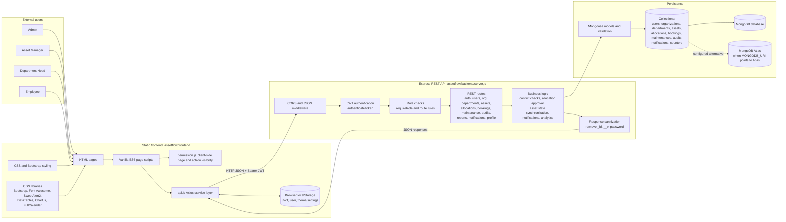
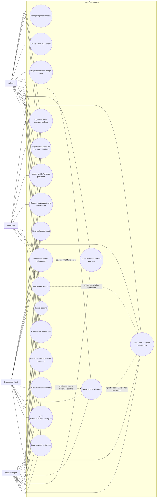
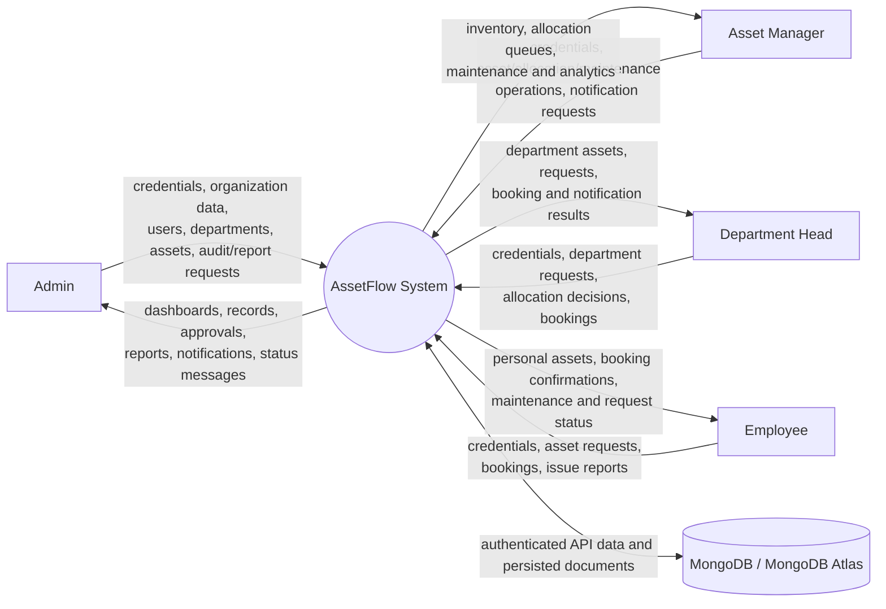
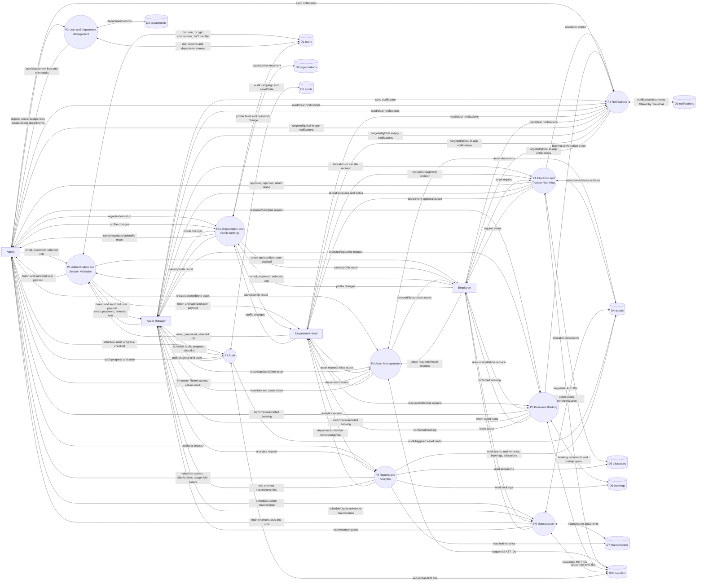

# AssetFlow — Project Diagrams

> **Repository-audited documentation.** These diagrams describe the current source code in `assetflow/`. They do not treat the existing `README.md` as authoritative when implementation details differ.
>
> **Implementation-status key:** Items labelled **Partially Implemented** or **UI-only** are present in the repository but are not represented as fully completed server-side workflows.

## 1. Entity Relationship Diagram (ER Diagram)

**Recommended placement:** Chapter 7.2 — Database Design / Chapter 9 — ER-Diagram

### Complete ER Diagram

The current application uses MongoDB collections with Mongoose schemas. The diagram shows the ten model collections imported by `backend/server.js`: `User`, `Organization`, `Department`, `Asset`, `Allocation`, `Booking`, `Maintenance`, `Audit`, `Notification`, and `Counter`.

The connections marked `..>` are **logical business-key relationships verified from the code**. They are not Mongoose `ObjectId` references: the schemas store strings such as `assetId`, `allocatedTo`, `requestedByEmail`, `department`, and `targetUserEmail`.

```mermaid
erDiagram
    ORGANIZATION {
        string name
        string orgName
        string code
        string industry
        string taxId
        string address
        string phone
        string website
        string timeZone
        string currency
        string fiscalYear
        string logo
        datetime createdAt
        datetime updatedAt
    }

    DEPARTMENT {
        string name PK
        string headName
        string headEmail
        datetime createdAt
        datetime updatedAt
    }

    USER {
        string email PK
        string password "select false"
        string fullName
        string role
        string department FK_LOGICAL
        string avatar
        boolean isVerified
        string status
        string transitionDetails
        datetime createdAt
        datetime updatedAt
    }

    ASSET {
        string id PK
        string name
        string type
        string serial UK
        string status
        number value
        string location
        string owner FK_LOGICAL
        string department FK_LOGICAL
        datetime createdAt
        datetime updatedAt
    }

    ALLOCATION {
        string id PK
        string assetId FK_LOGICAL
        string assetName
        string allocatedTo FK_LOGICAL
        string date
        string status
        string department FK_LOGICAL
        string requestedBy FK_LOGICAL
        string requestedByEmail FK_LOGICAL
        string targetRole
        string notes
        datetime createdAt
        datetime updatedAt
    }

    BOOKING {
        string id PK
        string resourceName FK_LOGICAL
        string bookedBy FK_LOGICAL
        string date
        string startTime
        string endTime
        string status
        string department FK_LOGICAL
        datetime createdAt
        datetime updatedAt
    }

    MAINTENANCE {
        string id PK
        string assetId FK_LOGICAL
        string assetName
        string type
        string description
        number cost
        string date
        string status
        datetime createdAt
        datetime updatedAt
    }

    AUDIT {
        string id PK
        string name
        string date
        string auditor FK_LOGICAL
        number progress
        string status
        mixed assetState
        datetime createdAt
        datetime updatedAt
    }

    NOTIFICATION {
        string id PK
        string title
        string message
        string type
        string date
        boolean read
        string targetRole FK_LOGICAL
        string targetUserEmail FK_LOGICAL
        datetime createdAt
        datetime updatedAt
    }

    COUNTER {
        string _id PK
        number value
    }

    ORGANIZATION ||--o{ DEPARTMENT : "organizes logically"
    DEPARTMENT ||--o{ USER : "groups by name"
    DEPARTMENT ||--o{ ASSET : "holds by name"
    DEPARTMENT ||--o{ ALLOCATION : "uses department string"
    DEPARTMENT ||--o{ BOOKING : "uses department string"
    ASSET ||--o{ ALLOCATION : "assetId string"
    ASSET ||--o{ MAINTENANCE : "assetId string"
    ASSET ||--o{ BOOKING : "resourceName may contain asset name"
    USER ||--o{ ALLOCATION : "allocatedTo/requester strings"
    USER ||--o{ BOOKING : "bookedBy string"
    USER ||--o{ AUDIT : "auditor string"
    USER ||--o{ NOTIFICATION : "target email or role"
    COUNTER ||--o{ ASSET : "generates AST IDs"
    COUNTER ||--o{ ALLOCATION : "generates ALC IDs"
    COUNTER ||--o{ BOOKING : "generates BKG IDs"
    COUNTER ||--o{ MAINTENANCE : "generates MNT IDs"
    COUNTER ||--o{ AUDIT : "generates AUD IDs"
```

### Mermaid source code

The complete source is the Mermaid `erDiagram` block above. It can be pasted into a Mermaid-compatible Markdown renderer. The `PK`, `UK`, and `FK_LOGICAL` labels describe application-level identifiers and logical links; only the schema indexes and uniqueness rules are enforced by Mongoose.

### Entities and important fields

| Entity / collection | Important fields verified in the Mongoose schema | Implementation note |
| --- | --- | --- |
| `users` | `email`, `password`, `fullName`, `role`, `department`, `avatar`, `isVerified`, `status`, `transitionDetails` | Email is unique and indexed; password is excluded from normal queries. |
| `organizations` | `name`, `orgName`, `code`, `industry`, `taxId`, `address`, `phone`, `website`, `timeZone`, `currency`, `fiscalYear`, `logo` | The API reads or upserts one organization document. |
| `departments` | `name`, `headName`, `headEmail` | Department name is unique; it is stored as a string in other models. |
| `assets` | `id`, `name`, `type`, `serial`, `status`, `value`, `location`, `owner`, `department` | `id` is the human-readable asset identifier; `serial` is sparse and unique. |
| `allocations` | `id`, `assetId`, `assetName`, `allocatedTo`, `date`, `status`, `department`, requester fields, `targetRole`, `notes` | Records requests, approvals, returns, and transfer-oriented requests. |
| `bookings` | `id`, `resourceName`, `bookedBy`, `date`, `startTime`, `endTime`, `status`, `department` | Compound index supports resource/date/status lookup; overlap is checked in the route. |
| `maintenances` | `id`, `assetId`, `assetName`, `type`, `description`, `cost`, `date`, `status` | Creation changes the related asset status to `Maintenance`; completion-like states restore `Active`. |
| `audits` | `id`, `name`, `date`, `auditor`, `progress`, `status`, `assetState` | `assetState` is `Mixed` and stores the checklist state saved by the audit UI. |
| `notifications` | `id`, `title`, `message`, `type`, `date`, `read`, `targetRole`, `targetUserEmail` | Notifications are global, role-targeted, or email-targeted. |
| `counters` | `_id`, `value` | Atomic `findOneAndUpdate` generates prefixes such as `AST-`, `ALC-`, and `BKG-`. |

### Verified relationships and cardinality

- One organization document is read/upserted by the organization API. The schema does not contain an embedded department array; organization-to-department is therefore a logical grouping, not a schema reference.
- A department name may occur in many `User`, `Asset`, `Allocation`, and `Booking` documents. This is a logical one-to-many relationship by string value, not an `ObjectId` relationship.
- One `Asset` business ID may occur in many `Allocation` records over time and many `Maintenance` records. The API checks approved allocation conflicts and updates the current asset state.
- One user may be represented in many allocations, bookings, audits, and notifications through names, emails, or roles. There is no `userId` field or Mongoose `ref` in these schemas.
- One `Counter` document per sequence is used by the server to generate many business IDs. The `Counter` model is an implementation utility rather than a business entity.
- `Booking.resourceName` is a free-text resource name selected from asset names in the frontend. It is not a strict asset foreign key, so the diagram labels that connection as a possible logical link.

### Detailed explanation

The database design is document-oriented. Mongoose validates the fields and creates indexes, while the Express routes coordinate cross-collection changes. For example, creating maintenance writes a `Maintenance` document and updates the matching `Asset`; approving an allocation writes the allocation and updates the selected asset; returning an asset closes approved allocations and clears the asset owner.

The design intentionally retains display snapshots such as `assetName` and uses business identifiers such as `AST-001`. This makes records readable in the UI, but it also means referential integrity is implemented by route logic rather than database foreign keys. A future normalized design could introduce ObjectId references, but that is not the current implementation and is not shown as implemented.

### Report-ready description

The ER diagram presents AssetFlow's MongoDB data model implemented with Mongoose. It includes users, organization and departments, assets, allocations, bookings, maintenance logs, audit campaigns, notifications, and the counter collection used for sequential identifiers. Relationships are based on verified business-key fields used by the Express API. Since the application does not use Mongoose `ObjectId` references between these models, the diagram distinguishes logical associations from database-enforced foreign keys.

**Figure 1 caption:** *Entity Relationship Diagram of the AssetFlow MongoDB collections and their verified logical associations.*

---

## 2. System Architecture Diagram

**Recommended placement:** Chapter 7 — System Design

### Complete system architecture



### Mermaid source code

The complete source is the Mermaid `flowchart LR` block above. The frontend is shown as a separately hosted static application because `server.js` initializes and listens for the API but does not serve the frontend directory.

### Detailed explanation

1. **Users and frontend:** Admin, Asset Manager, Department Head, and Employee use the HTML pages. `components.js` injects the shared sidebar, navbar, and footer. Page scripts load data and submit operations through `ApiService`.
2. **Client-side authorization:** `permission.js` controls visible pages and elements according to role. This improves the UI experience but is not the sole security boundary.
3. **API layer:** `api.js` uses Axios, chooses `http://localhost:3000/api` for local/file mode or `/api` for same-origin hosting, and attaches the JWT from `localStorage` as a Bearer token.
4. **Authentication and authorization:** `server.js` verifies JWTs in `authenticateToken`; selected operations add `requireRole` or explicit role checks. Login uses bcryptjs and signs a 24-hour JWT. Role labels are normalized for comparisons.
5. **Business logic:** Express handlers generate IDs through `Counter`, prevent overlapping bookings, prevent double allocation on approval, synchronize asset status with maintenance, create notifications, and calculate analytics from multiple collections.
6. **Mongoose and MongoDB:** `db.js` calls `mongoose.connect` using `MONGODB_URI`, defaulting to `mongodb://127.0.0.1:27017/assetflow_db`. MongoDB Atlas is available only when the configured URI points to Atlas; it is not hard-coded as the only database.
7. **Supporting libraries:** The HTML pages reference Bootstrap, Font Awesome, SweetAlert2, DataTables, Chart.js, and FullCalendar through CDN links. The backend package declares Express, Mongoose, bcryptjs, jsonwebtoken, cors, dotenv, and nodemon.

### Actual component status

- **Implemented:** static HTML/CSS/vanilla JavaScript UI, Axios service layer, Express routes, JWT login, bcrypt password hashing, Mongoose schemas, MongoDB connection, role-aware navigation, CRUD/workflow handlers, and analytics.
- **Partially Implemented:** password recovery OTP behavior. `/api/auth/verify-otp` and `/api/auth/resend-otp` return simulated success responses; no OTP store or delivery service exists.
- **Partially Implemented:** settings are browser-local (`localStorage`) rather than persisted in MongoDB.
- **Not shown as implemented:** React, Next.js, SQL/MySQL, a server-side PDF generator, email/SMS/push delivery, or a separate microservice layer.

### Report-ready description

The AssetFlow architecture follows a separated client-server model. A static HTML/CSS/vanilla JavaScript frontend provides role-aware screens and communicates through an Axios service layer. An Express REST API authenticates requests with JWT bearer tokens, applies role checks, executes asset-management business rules, and persists validated documents through Mongoose in MongoDB. The deployment can use a local MongoDB instance or MongoDB Atlas through the configured connection URI.

**Figure 2 caption:** *Layered system architecture of AssetFlow showing role-aware frontend access, Express API processing, Mongoose validation, and MongoDB persistence.*

---

## 3. Use Case Diagram

**Recommended placement:** Chapter 7.1 — System Modules & Use Cases

### Mermaid/UML source code

Mermaid does not provide a native UML use-case diagram primitive in the repository tooling, so the following UML-style Mermaid flowchart uses actors and use-case nodes. Every listed use case is mapped to a route, frontend script, page, or verified role permission in the current source.



### Actors

| Actor | Verification in source | Main access shown by current UI/RBAC |
| --- | --- | --- |
| **Admin** | Backend seed data and exact role checks in `server.js`; frontend `permission.js` | Organization setup, department and user administration, asset operations, bookings, maintenance, audits, reports, notifications, profile. |
| **Asset Manager** | Backend seed data, allocation permission helper, and frontend RBAC | Inventory, allocations/transfers, bookings, maintenance approval, audits, reports, notifications, profile. |
| **Department Head** | Backend seed data and allocation-management helper; frontend role-specific views | Department-oriented assets, allocation approval/request flow, bookings, reports, notifications, profile. |
| **Employee** | Backend seed data, registration allow-list, and frontend RBAC | Personal/department asset views, asset requests/returns, bookings, maintenance reports, notifications, profile. |

The frontend also accepts the compatibility spellings `AssetManager` and `DepartmentHead`. The canonical seeded/backend labels are `Asset Manager` and `Department Head`.

### Verified use cases by area

- **Authentication:** login; authenticated registration by Admin for Employee, Department Head, or Asset Manager; password change; forgot-password and reset-password endpoints; OTP verification/resend screens. OTP verification and delivery are **Partially Implemented/simulated**.
- **Organization and users:** read/update the single organization document; Admin creates/deletes departments; Admin lists users, registers permitted roles, assigns or changes roles and departments, and records transition details.
- **Assets:** list, create, update, delete, filter by scope in the UI, request an available asset, and return an allocated asset. The route is authenticated, but some asset mutation routes rely mainly on authentication while the frontend hides controls by role.
- **Allocations:** create a request, approve, reject, return, assign a selected asset, update asset ownership, and create related notifications. Employees create pending department-head requests; non-employees create approved allocations according to the current route logic.
- **Bookings:** list, create a confirmed booking after overlap validation, show a calendar, and cancel. The backend allows cancellation for Admin, Asset Manager, or the booking owner; the frontend hides cancellation for Employees.
- **Maintenance:** create a maintenance record or employee issue report, set the asset to `Maintenance`, update status/cost, and restore the asset to `Active` for completion-like statuses. The UI includes a kanban workflow, but only statuses sent through the current API are persisted.
- **Audits:** schedule campaigns, update progress, read/write mixed checklist state, and view campaign status. Audit discrepancy evidence and a complete immutable audit trail are not implemented.
- **Reports and notifications:** view dashboard metrics and `/api/reports/analytics`; view, mark read, and clear notifications; Admin and Asset Manager send targeted notifications. Reports are browser-rendered with chart/table/export behavior; the backend does not generate a PDF file.

### Role-to-function relationships and boundaries

- The **Admin** is the organization operator. Explicit server restrictions cover registration, role changes, department create/delete, notification sending, and development database reset. Other authenticated mutations remain broader than the UI's role matrix, so the diagram does not claim universal server-side enforcement for every Admin-only button.
- The **Asset Manager** manages inventory and allocation/maintenance actions and can send notifications. The backend allocation helper explicitly includes this role.
- The **Department Head** approves allocation actions according to the backend role helper and is scoped to department-oriented records by frontend filtering. The backend does not fully enforce department-specific approval scope on every route.
- The **Employee** submits allocation requests, books resources, reports maintenance, and can return assets subject to current owner checks. An employee allocation is created with `Pending Department Head Approval` by the server.

### Detailed explanation

The diagram separates actors from system use cases and keeps presentation-only labels out of the use-case set. For example, “AI resource detection” is not listed as a use case because the code implements client-side conflict display, not an AI service. “Export PDF” is not listed as a server report use case because the reports page uses browser-side export/print behavior and no PDF backend exists.

### Report-ready description

The use-case diagram identifies the four implemented roles of AssetFlow and their interactions with authentication, organization administration, inventory, allocation, resource booking, maintenance, audit, reporting, notification, and profile functions. The role matrix reflects the current source code while noting partially implemented password recovery, audit detail, and the distinction between client-side visibility and server-side authorization.

**Figure 3 caption:** *Use-case view of AssetFlow showing verified actors, role-oriented functions, and the main allocation, booking, maintenance, audit, reporting, and notification interactions.*

---

## 4. Data Flow Diagram (DFD)

**Recommended placement:** Chapter 7 — System Design

### 4.1 Level 0 — Context Diagram

The context diagram treats AssetFlow as one central system and shows only major external entities and information exchanged with it.



### Level 0 explanation

- Actors send credentials, operational requests, and management inputs to the AssetFlow frontend/API boundary.
- AssetFlow returns authenticated dashboards, filtered records, workflow outcomes, analytics, and in-app notifications.
- MongoDB is the persistent external data store from the context perspective. The actual runtime uses local MongoDB by default and can use Atlas through `MONGODB_URI`.

**Figure 4 caption:** *Level 0 context DFD showing AssetFlow as the central system between organizational roles and MongoDB persistence.*

### 4.2 Level 1 — Detailed DFD

The Level 1 diagram decomposes the system into processes that are present in the repository. It shows the actual Mongoose-backed data stores and the principal input/output paths.



### Level 1 process and data-store mapping

| Process | Verified implementation | Main data stores |
| --- | --- | --- |
| P1 Authentication and Session Validation | Login, bcrypt comparison, JWT generation, token middleware; OTP endpoints are simulated | `users` |
| P2 User and Department Management | User listing/registration/role changes; department list/create/delete | `users`, `departments` |
| P3 Asset Management | Asset list/create/update/delete/return and frontend filtering | `assets`, `counters` |
| P4 Allocation and Transfer Workflow | Requests, approval/rejection/return actions, asset updates, notifications | `allocations`, `assets`, `counters`, `notifications` |
| P5 Resource Booking | Create/list/cancel and server-side overlap detection | `bookings`, `counters`, `notifications` |
| P6 Maintenance | Create logs, update status/cost, synchronize asset status | `maintenances`, `assets`, `counters` |
| P7 Audit | Schedule campaigns, update progress, read/write mixed checklist state | `audits`, `assets`, `counters` |
| P8 Notifications | List by role/email/global, create, mark read, clear | `notifications` |
| P9 Reports and Analytics | Aggregates valuation, maintenance cost, counts, distributions, usage, idle assets | `assets`, `maintenances`, `bookings`, `allocations` |
| P10 Organization and Profile Settings | Organization upsert; profile update/password change; browser-only display settings | `organizations`, `users`, browser `localStorage` |

### Data-flow details and verified business rules

- The frontend stores the JWT and user payload in browser `localStorage`; `api.js` attaches the token to API requests.
- `authenticateToken` rejects missing tokens with 401 and invalid/expired tokens with 403. The frontend response interceptor clears local session state on 401.
- Registration is an authenticated Admin operation. The backend allow-list accepts Employee, Department Head, and Asset Manager, not Admin self-registration.
- Allocation approval requires a selected asset and rejects an asset with an existing owner or another approved allocation. Approved allocations update asset owner and department.
- Booking creation rejects missing fields, an invalid time range, and overlapping non-cancelled records for the same resource/date.
- Maintenance creation writes a record and marks the referenced asset `Maintenance`; `Resolved`, `Completed`, `Rejected`, and `Cancelled` restore `Active`.
- Analytics reads four model collections and returns aggregate values; the frontend renders role-oriented charts and tables.
- Notifications created by allocation, booking, and return workflows flow through the notification store and are filtered by role or email for retrieval.

### Report-ready description

The Level 0 DFD presents AssetFlow as the single context process exchanging requests and results with four roles and MongoDB. The Level 1 DFD decomposes the implementation into authentication, user/department, asset, allocation, booking, maintenance, audit, notification, reporting, and organization/profile processes. Each process is connected to the Mongoose-backed data stores verified in the source code, with the principal cross-process flows such as asset-state synchronization and workflow notifications shown explicitly.

**Figure 5 caption:** *Level 1 Data Flow Diagram of AssetFlow showing implemented processes, external roles, MongoDB data stores, and major operational data flows.*

---

# Viva Questions Related to Diagrams

1. **What database does AssetFlow use?**  
   AssetFlow uses MongoDB, accessed through Mongoose. The default local URI is `mongodb://127.0.0.1:27017/assetflow_db`; an Atlas URI can be supplied through `MONGODB_URI`.

2. **Why is the ER diagram shown as a document model rather than SQL tables?**  
   The repository defines Mongoose schemas and MongoDB collections, not SQL tables. The entities in the diagram represent those collections.

3. **Does AssetFlow use Mongoose ObjectId references between models?**  
   No. Cross-model links use application strings such as `assetId`, email, names, and department names. The Express routes maintain the logical relationships.

4. **What is the primary business identifier of an asset?**  
   It is the string `id`, such as `AST-001`. The server generates it using the `Counter` model.

5. **What is the purpose of the Counter model?**  
   It atomically increments a sequence and creates readable IDs for assets, allocations, bookings, maintenance records, and audits.

6. **Which field is unique in the User model?**  
   `email` is required, lowercased, indexed, and unique. It is the user's main identity key in API operations.

7. **How does a login request work?**  
   The client sends email, password, and selected role. The server finds the user, compares the bcrypt hash, checks the role and active status, then returns a 24-hour JWT and a sanitized user payload.

8. **How is an authenticated request recognized?**  
   The frontend sends the JWT in the `Authorization: Bearer <token>` header. `authenticateToken` verifies it with `jsonwebtoken` and places the decoded identity in `req.user`.

9. **What are the four implemented roles?**  
   Admin, Asset Manager, Department Head, and Employee. The frontend also recognizes no-space compatibility spellings for two of them.

10. **What does RBAC mean in this project?**  
    RBAC means role-based access control. `permission.js` controls page and element visibility, while Express route checks enforce authentication and selected role restrictions on the server.

11. **Can an Employee approve an allocation?**  
    No. Employee allocation requests are created with `Pending Department Head Approval`. Approval actions are allowed by the backend helper for Admin, Asset Manager, and Department Head.

12. **How does allocation approval protect an asset?**  
    The server requires a specific asset and checks whether another approved allocation exists or the asset already has an owner. If either condition is true, approval is rejected.

13. **What happens when an asset is returned?**  
    The API clears its owner, sets its status to `Active`, marks approved allocations for that asset as `Returned`, and creates a notification for the Asset Manager role.

14. **How does booking conflict detection work?**  
    For the same resource and date, an existing non-cancelled booking conflicts when `existing.startTime < requested.endTime` and `existing.endTime > requested.startTime`.

15. **Why is a booking's user identity not trusted from the browser?**  
    The server derives `bookedBy` and department from the authenticated JWT. This prevents a client from authoritatively booking under another identity.

16. **What happens when maintenance is created?**  
    A maintenance document is created with a generated `MNT-` ID and `Pending` status, and the matching asset is updated to `Maintenance`.

17. **How does maintenance completion affect the asset?**  
    For `Resolved`, `Completed`, `Rejected`, or `Cancelled`, the server changes the related asset back to `Active`.

18. **What does an Audit document store?**  
    It stores an ID, campaign name, date, auditor, progress percentage, status, and a mixed `assetState` value used for checklist state.

19. **Is the audit module a complete immutable audit trail?**  
    No. It is Partially Implemented. Campaign progress and checklist state are persisted, but immutable discrepancy evidence and a full audit history are not implemented.

20. **How are notifications targeted?**  
    A notification can be global, targeted to a role through `targetRole`, or targeted to a user email through `targetUserEmail`. The list route returns matching records.

21. **Which workflows generate notifications automatically?**  
    Allocation requests/actions, confirmed bookings, and asset returns call the backend notification helper. Admins and Asset Managers can also send notifications manually.

22. **How are reports produced?**  
    `/api/reports/analytics` calculates valuation, maintenance cost, asset count, department/status distributions, resource usage, and idle assets. The frontend renders charts and tables using Chart.js/DataTables and offers browser-side export/print behavior.

23. **Does the backend generate PDF reports?**  
    No. The current repository has no server-side PDF generator. The reports page provides frontend export/print-oriented behavior.

24. **Is OTP verification fully implemented?**  
    No. The OTP pages and API endpoints exist, but verify and resend endpoints return simulated success messages. There is no OTP persistence or email delivery service.

25. **Where are theme and display settings stored?**  
    Theme, language, and notification preference values are stored in browser `localStorage`. They are not stored in the MongoDB User document.

26. **Does the Express backend serve the HTML frontend?**  
    No. The repository uses a separate static frontend, such as a static web server or Live Server, and the backend exposes the REST API.

27. **What is the role of Mongoose?**  
    Mongoose connects the Node.js application to MongoDB, defines schemas, validates values, applies indexes, and provides model methods used by the Express routes.

28. **What is the difference between frontend RBAC and backend authorization here?**  
    Frontend RBAC hides pages and controls for usability. Backend middleware and explicit route checks are the security boundary, although the current source does not apply equally fine-grained role restrictions to every mutation endpoint.

29. **How does the dashboard get its data?**  
    `dashboard.js` requests assets, allocations, bookings, maintenance, notifications, departments, and users when needed, then filters and aggregates those results by the current role.

30. **How do the four diagrams remain consistent?**  
    The ER diagram uses the actual Mongoose models, the architecture uses the actual static frontend/Express/Mongoose/MongoDB stack, the use-case diagram uses the four source-defined roles and workflows, and the DFD connects those workflows to the same collections and API behavior.
