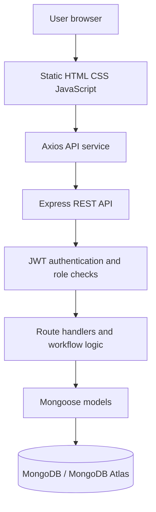
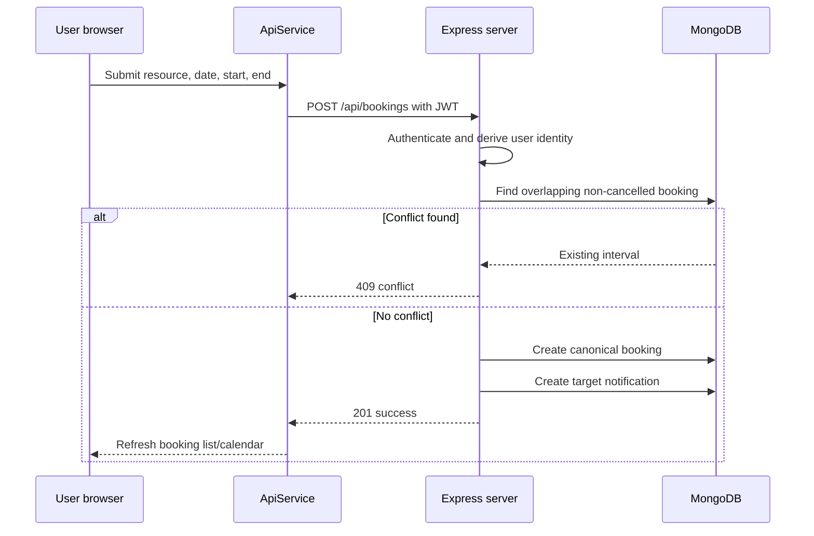
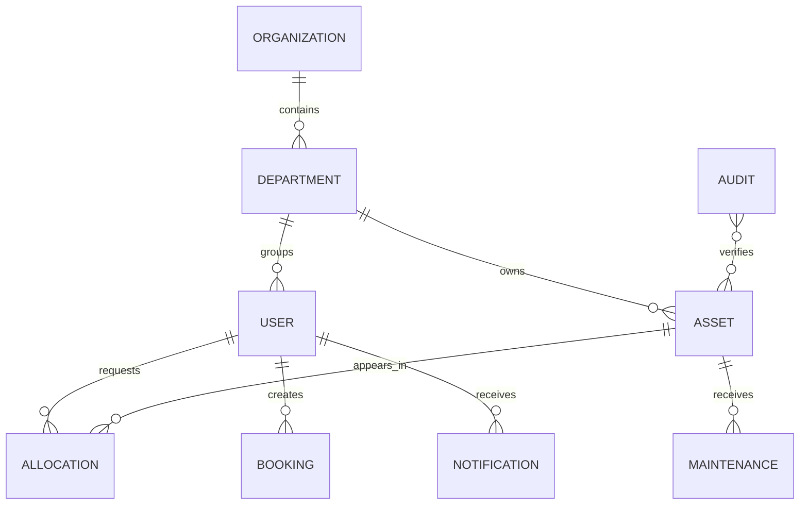
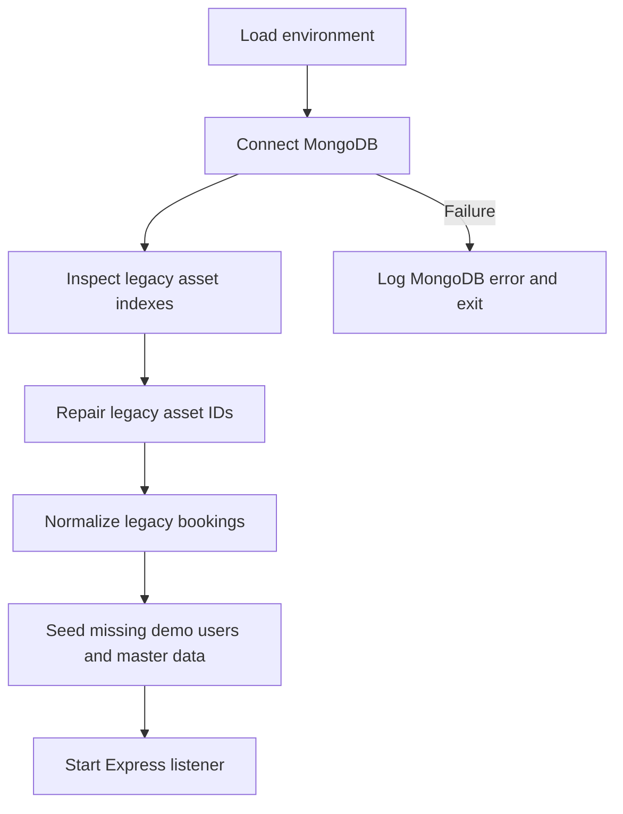

# AssetFlow

## Enterprise IT Asset & Resource Management System

AssetFlow is a web-based IT asset and resource management system for organizations that need one place to record equipment, assign custody, coordinate shared resources, schedule maintenance, conduct audits, notify users, and review operational analytics.

It is an existing full-stack application built with a static HTML/CSS/JavaScript frontend, an Express REST API, JWT authentication, bcrypt password hashing, and MongoDB persistence through Mongoose. The frontend is intentionally framework-free and can be opened through a static web server such as VS Code Live Server. The backend is started separately and exposes the `/api` contract consumed by the frontend.

> **Documentation status:** This document describes the repository as implemented. Features marked **Partially Implemented** or **Planned / Future Enhancement** are deliberately not presented as production-complete.

## Project At A Glance

| Item | Current implementation |
| --- | --- |
| Project name | AssetFlow |
| Category | IT asset management / ERP-style operations system |
| Frontend | Static HTML, CSS, vanilla ES6 JavaScript |
| UI libraries | Bootstrap, Font Awesome, SweetAlert2, DataTables, Chart.js, FullCalendar |
| Backend | Node.js and Express |
| Database | MongoDB through Mongoose |
| Authentication | JWT bearer tokens and bcryptjs password hashes |
| Roles | Admin, Asset Manager, Department Head, Employee |
| API base | `http://localhost:3000/api` in local/file mode, `/api` when same-origin hosted |
| Persistence | MongoDB collections with Mongoose schemas and timestamps |
| Startup | Connect, migrate legacy records, seed missing demo data, then listen |
| Frontend hosting | Separate static hosting or direct/Live Server usage |
| Current test tooling | No repository test runner, lint script, or browser automation suite |

## Contents

1. [Executive Summary](#executive-summary)
2. [Problem Statement](#problem-statement)
3. [Objectives and Scope](#objectives-and-scope)
4. [Users and Roles](#users-and-roles)
5. [Implemented Features](#implemented-features)
6. [System Architecture](#system-architecture)
7. [Repository Structure](#repository-structure)
8. [Frontend Architecture](#frontend-architecture)
9. [Backend Architecture](#backend-architecture)
10. [Database Design](#database-design)
11. [Data Initialization and Migration](#data-initialization-and-migration)
12. [API Reference](#api-reference)
13. [Business Workflows](#business-workflows)
14. [Security Model](#security-model)
15. [Installation and Configuration](#installation-and-configuration)
16. [Demo Dataset](#demo-dataset)
17. [Testing and Verification](#testing-and-verification)
18. [Known Limitations](#known-limitations)
19. [Future Enhancements](#future-enhancements)
20. [Presentation and Viva Guide](#presentation-and-viva-guide)
21. [Maintenance Guide](#maintenance-guide)

## Executive Summary

### What AssetFlow Does

AssetFlow centralizes the operational record of organizational technology and shared resources. An administrator or asset manager can view an inventory, record assets, allocate equipment, return equipment, coordinate transfers, schedule maintenance, and inspect reports. Department heads and employees interact with the same system through role-specific dashboards and navigation.

The application models an organization in terms of:

- people and their departments;
- assets and their current owner or department;
- allocation requests and allocation history;
- bookable resources and time ranges;
- maintenance records associated with assets;
- audit campaigns and asset verification state;
- targeted or role-wide notifications; and
- aggregate metrics for dashboards and reports.

### Why This System Exists

Many organizations begin with spreadsheets, email, paper registers, and calendar invitations. Those tools can record isolated facts, but they do not provide a consistent operational workflow. AssetFlow brings those facts into a common API and database so that an asset can be located, assigned, returned, placed into maintenance, and reviewed during an audit without maintaining several disconnected records.

### Manual Administration Compared With AssetFlow

| Manual approach | AssetFlow approach |
| --- | --- |
| Separate Excel sheets for inventory | Central asset collection with searchable frontend views |
| Paper or email allocation requests | Allocation records with statuses and notifications |
| Personal calendar for rooms and shared assets | Booking records with overlap detection |
| Maintenance information in email threads | Maintenance documents linked to asset IDs |
| Manual audit counting | Audit records with progress and stored asset state |
| Unclear ownership | Asset owner, department, and allocation history fields |
| Repeated data entry | Shared API and MongoDB records used by dashboards and reports |
| Difficult role separation | JWT identity plus client-side role navigation and server-side checks on key operations |
| Static management summaries | Analytics calculated from assets, bookings, maintenance, and allocations |

### Current Maturity

The repository is suitable for a college, hackathon, or viva demonstration of a MongoDB-backed operations application. Core inventory, authentication, allocation, booking, maintenance, audit, notification, and analytics paths exist. It is not yet a fully hardened enterprise deployment: OTP recovery is simulated, several mutation routes need finer-grained authorization, and browser end-to-end automation is not included.

## Problem Statement

### 1. Asset visibility

Organizations may own laptops, monitors, networking equipment, printers, accessories, projectors, and other equipment distributed across departments. Without a central inventory, staff cannot reliably answer what exists, where it is, or who has custody. AssetFlow stores an inventory record with a stable human-readable ID, type, serial, status, value, location, owner, and department.

### 2. Ownership and custody

When an asset moves from stock to a person or department, the organization needs more than a verbal acknowledgement. AssetFlow represents ownership through the asset owner field and allocation records. Return operations clear the current owner and close approved allocations.

### 3. Allocation conflicts

An asset should not be assigned to two people at once. Allocation approval checks for an existing approved allocation and an existing owner before accepting a selected asset. This is implemented at the API boundary so the decision does not depend only on a browser dropdown.

### 4. Shared-resource conflicts

Conference rooms, training spaces, projectors, and similar resources can be requested by multiple teams. The booking endpoint checks the same resource and date using the interval rule `existing.startTime < requested.endTime` and `existing.endTime > requested.startTime`. Cancelled bookings do not block a new interval.

### 5. Maintenance tracking

An asset may be unusable while its repair history is invisible. AssetFlow records maintenance type, description, cost, date, status, asset ID, and asset name. Creating a maintenance record changes the related asset to `Maintenance`; completion-like statuses return it to `Active`.

### 6. Audit accountability

Periodic inventory checks need a named audit, auditor, date, progress, status, and checklist state. AssetFlow stores those values and supports separate progress and state endpoints.

### 7. Department coordination

The same system serves central administrators, asset managers, department heads, and employees. Navigation and page access are adapted by role. Department and user fields are stored consistently as department names in the current schema.

### 8. Notification visibility

An allocation approval or booking confirmation is easy to miss when it is communicated only by email or chat. AssetFlow creates notifications that can target a role, an email address, or all authenticated users, and supports read and clear operations.

### 9. Management insight

Raw asset rows are not enough for decisions. The analytics endpoint calculates valuation, maintenance cost, asset totals, department distribution, status distribution, most-used resources, and idle assets from MongoDB data.

## Objectives And Scope

### Primary objectives

1. Maintain a persistent inventory in MongoDB.
2. Preserve stable application IDs such as `AST-001`, `ALC-001`, and `BKG-001`.
3. Provide role-aware authentication and navigation.
4. Support asset assignment, return, and allocation history.
5. Prevent overlapping confirmed bookings.
6. Connect maintenance and audit records to assets.
7. Give managers a data-backed dashboard and reports view.

### Technical objectives

- Use Mongoose schemas rather than SQL tables or query strings.
- Start Express only after MongoDB initialization succeeds.
- Keep passwords out of normal user query results.
- Use an atomic counter for sequential IDs.
- Make startup seeding idempotent and non-destructive.
- Preserve the existing frontend API contract, including `/api/login` as a login alias.
- Use a separate static frontend and REST backend without introducing a second frontend framework.

### In scope and status

| Area | Status | Scope in the current repository |
| --- | --- | --- |
| Authentication | Implemented | Login, JWT generation, role selection, active-status check, password hashing |
| User management | Partially Implemented | User listing, Admin registration, role/department changes, profile updates |
| Departments | Implemented | List, create, delete, unique department names |
| Organization | Implemented | Read and update organization settings |
| Assets | Implemented | List, create, update, delete, return, filtering in frontend |
| Allocations | Implemented | Request, approve/reject/return actions, notifications, double-allocation guard |
| Bookings | Implemented | Create, list, cancellation, overlap detection, FullCalendar integration |
| Maintenance | Implemented | Create records, statuses, costs, asset synchronization |
| Audits | Partially Implemented | Create, progress, saved checklist state; richer discrepancy workflow is UI-driven |
| Notifications | Implemented | Targeted list, create, mark read, clear |
| Analytics | Implemented | MongoDB-backed totals, distributions, usage, idle list |
| Reports | Implemented in frontend | Charts, tables, CSV/print-oriented reporting |
| Settings | Partially Implemented | Browser-local theme, language and notification preferences |
| Password recovery | Partially Implemented | UI and endpoints exist, but OTP verification is simulated |

### Out of scope for the current implementation

The repository does not implement payroll, accounting, invoicing, procurement, vendor purchasing, HR attendance, email delivery, or a server-side document-management system. These are not described as current features.

## Users And Roles

AssetFlow uses four role labels in the backend and frontend. The frontend also recognizes the no-space aliases `AssetManager` and `DepartmentHead` for compatibility.

### Admin

The Admin is the organization-level operator. The UI provides organization setup, department administration, user registration, role assignment, reports, notifications, asset operations, bookings, maintenance, and audits. The server explicitly restricts department changes, role changes, user registration, and development reset to Admin-level operations. Notification creation accepts Admin and Asset Manager roles.

### Asset Manager

The Asset Manager is responsible for inventory operations, allocations, transfers, maintenance, audits, bookings, reports, and notifications. Asset Manager is allowed to approve allocation actions through the server and can cancel bookings and return assets.

### Department Head

The Department Head is given department-oriented dashboard and allocation pages. The frontend exposes allocation approval, transfer requests, booking, reports, notifications, and profile. The backend recognizes Department Head as an allocation-management role, but department-specific approval scoping is not yet as strict as the UI presentation.

### Employee

The Employee sees personal or department asset views, booking, maintenance requests, notifications, and profile. Employees can create allocation requests and bookings. The server derives booking identity from the authenticated JWT rather than trusting a client-supplied `bookedBy` field.

### Role and module matrix

The matrix describes the intended current UI access and important server enforcement. A check in the frontend does not replace backend authorization.

| Module | Admin | Asset Manager | Department Head | Employee |
| --- | ---: | ---: | ---: | ---: |
| Dashboard | ✓ | ✓ | ✓ | ✓ |
| Organization setup | ✓ | ✗ | ✗ | ✗ |
| User list | ✓ | Limited by UI | Limited by UI | Limited by UI |
| Department administration | ✓ | ✗ | ✗ | ✗ |
| Asset inventory | ✓ | ✓ | Department-oriented UI | My/department-oriented UI |
| Allocation and transfer | Limited | ✓ | ✓ | Request/return actions |
| Booking | ✓ | ✓ | ✓ | ✓ |
| Maintenance | ✓ | ✓ | Limited UI | Request-oriented UI |
| Audit | ✓ | ✓ | ✗ in client matrix | ✗ in client matrix |
| Reports | ✓ | ✓ | Department reports | ✗ in client matrix |
| Notifications | ✓ | ✓ | ✓ | ✓ |
| Profile | ✓ | ✓ | ✓ | ✓ |

## Implemented Features

### Authentication

The login form sends `email`, `password`, and `role` to `/api/auth/login`. The same handler is available at `/api/login` for compatibility. The server lowercases email, compares the selected role after normalization, checks the bcrypt hash, checks the user status, and returns a 24-hour JWT. The response contains `success`, `token`, and a user payload with email, name, role, department, and avatar.

Registration exists for authenticated Admin users through `/api/auth/register` and `/api/auth/signup`. The server allows Employee, Department Head, and Asset Manager registration, but does not allow a caller to register an Admin account.

### Dashboard

`dashboard.js` loads assets, allocations, bookings, maintenance, notifications, departments, and users as needed. The dashboard chooses layouts for Admin, Asset Manager, Department Head, and Employee. It renders KPI cards, charts, recent activities, allocation information, asset views, and booking tables.

### Asset management

Assets use stable string IDs and contain `name`, `type`, `serial`, `status`, `value`, `location`, `owner`, and `department`. The frontend provides list views, filters, creation and editing interfaces, return actions, and role-specific visibility. The backend performs Mongoose validation and handles duplicate unique values with HTTP 409.

### Allocation and transfer

Allocation creation derives the requester identity from the JWT, finds the target person or department, and creates either an approved operation for non-employees or a pending department-head request for employees. Approval can attach a specific asset. The server rejects an approval when the chosen asset already has an owner or an approved allocation. Notifications are generated for pending requests and final actions.

### Resource booking

Bookings use the canonical structure shown below:

```json
{
  "id": "BKG-001",
  "resourceName": "Conference Room A",
  "bookedBy": "Riya Shah",
  "date": "2099-01-15",
  "startTime": "10:00",
  "endTime": "11:00",
  "status": "Confirmed",
  "department": "IT"
}
```

The booking page includes resource selection, date/time input, conflict indicators, a FullCalendar view, booking list, cancellation, and event details. The API also repairs legacy documents containing `assetName`, `bookedByName`, `startDate`, or `endDate`.

### Maintenance

Maintenance records contain an ID, asset ID, asset name, type, description, cost, date, and status. The frontend supports list and workflow views. Creation updates the related asset to `Maintenance`; `Resolved`, `Completed`, `Rejected`, and `Cancelled` statuses restore the asset to `Active`.

### Audits

Audit records contain a stable ID, name, date, auditor, progress, status, and a mixed `assetState` object for checklist state. The frontend supports audit scheduling, progress updates, and state persistence. More formal evidence management and immutable audit trails remain future work.

### Notifications

Notifications have stable IDs, title, message, type, date, read state, target role, and target email. Lists are filtered by public notifications, the current role, or the current email. Booking, allocation, and return operations generate notifications through the backend helper.

### Reports and analytics

The analytics endpoint calculates total valuation, total maintenance cost, asset count, department distribution, status distribution, most-used resources, and idle assets. The reports frontend adds chart rendering, report tables, CSV export, and browser print output. It does not generate a server-side PDF file.

## Module Reference

This section describes the responsibility and implementation boundary of every major module. It is intended to help a reviewer move from the user-facing page to the relevant frontend script, API method, route, and model.

### Authentication module

**Purpose:** establish a user session and protect application pages.

**Frontend:** `pages/login.html`, `pages/forgot-password.html`, `pages/otp-verification.html`, `pages/reset-password.html`, `assets/js/auth.js`, and the authentication section of `assets/js/api.js`.

**Backend:** login and recovery handlers in `backend/server.js`, `User` model, bcryptjs, and jsonwebtoken.

**Input:** email, password, and selected role. The selected role is normalized so differences in capitalization, spaces, and underscores do not cause an otherwise valid role comparison to fail.

**Output:** a JWT and a sanitized user payload. The frontend stores both values locally and redirects to the dashboard.

**Business rule:** an inactive user cannot log in. Passwords are compared against hashes and are never returned in normal user responses.

**Status:** Implemented for login and session restoration. Password recovery is Partially Implemented because OTP delivery and verification are simulated.

### Dashboard module

**Purpose:** give each role a quick operational summary.

**Frontend:** `pages/dashboard.html` and `assets/js/dashboard.js`.

**Data sources:** assets, allocations, bookings, maintenance, notifications, departments, and users through `ApiService`.

**Rendered information:** KPI cards, charts, recent activity, recent bookings, allocation requests, asset ownership views, and role-specific shortcuts.

**Role behavior:** Admin and Asset Manager receive wider operational views. Department Head receives department-oriented allocation and booking sections. Employee receives personal/department asset views and personal booking information.

**Status:** Implemented, with the limitation that some chart values and labels are presentation-oriented rather than a complete financial or utilization model.

### User management module

**Purpose:** allow administrators to see users, register allowed operational roles, and change roles or departments.

**Frontend:** `org-setup.html` and `assets/js/org-setup.js`.

**Backend:** `GET /api/users`, `POST /api/auth/register`, `POST /api/auth/signup`, and `PUT /api/users/role`.

**Data:** User documents use email as the unique business key. Department is currently stored as a string rather than an ObjectId reference.

**Special workflow:** assigning a new Department Head can demote the old head and preserve transition details such as retired, transferred, demoted, or resigned context.

**Status:** Partially Implemented. The core admin workflow exists, but deletion/deactivation and strict server-side organization-wide authorization should be expanded.

### Department module

**Purpose:** provide the organizational grouping used by people, assets, allocations, and dashboard filters.

**Frontend:** department controls in `org-setup.html`, allocation selectors, asset filters, and reports.

**Backend:** `GET /api/departments`, `POST /api/departments`, and `DELETE /api/departments/:name`.

**Data rules:** names are trimmed and unique. The current application uses the department display name as the shared value in user and asset records.

**Status:** Implemented for basic master-data operations. A separate immutable department code is not currently modeled.

### Organization module

**Purpose:** store organization identity and configuration information shown in setup and navigation areas.

**Frontend:** `pages/org-setup.html` and `assets/js/org-setup.js`.

**Backend:** `GET /api/org` and `PUT /api/org`.

**Fields:** organization name, code, industry, tax ID, address, phone, website, time zone, currency, fiscal year, and logo.

**Status:** Implemented as a single organization document. Multi-tenant organization separation is not implemented.

### Asset module

**Purpose:** maintain the inventory and current operational state of equipment.

**Frontend:** `pages/assets.html` and `assets/js/assets.js`.

**Backend:** asset CRUD endpoints and the return endpoint in `server.js`.

**Lifecycle fields:** `status`, `owner`, and `department` are the primary current-state fields. Current seed values include `Active`, `Available`, and `Maintenance`; the repository also contains UI handling for states such as `Disposed`.

**Status:** Implemented for the current schema. Purchase dates, warranty details, depreciation schedules, and rich attachment management are not present in the model.

### Allocation module

**Purpose:** coordinate requests, approvals, assignment, return, and transfer-oriented UI actions.

**Frontend:** `pages/allocation.html` and `assets/js/allocation.js`.

**Backend:** allocation list, creation, and action routes, plus Asset updates and Notification creation.

**Key safety rule:** an approval is rejected if the selected asset already has an owner or another approved allocation.

**Current status vocabulary:** `Approved`, `Rejected`, `Returned`, and `Pending Department Head Approval`, with additional target-role information stored on the record.

**Status:** Implemented for the main request/action path. A complete server-side transfer state machine and transaction-backed multi-document workflow are Planned / Future Enhancement.

### Booking module

**Purpose:** schedule shared resources and avoid time conflicts.

**Frontend:** `pages/booking.html` and `assets/js/booking.js`.

**Backend:** `Booking` model and booking endpoints.

**Presentation:** the page includes a FullCalendar month/week view, resource selectors, active booking list, conflict timeline, booking details, and cancellation controls.

**Conflict rule:** an existing non-cancelled booking conflicts when its start is before the requested end and its end is after the requested start for the same resource and date.

**Identity rule:** `bookedBy` and department come from the authenticated JWT. Client-provided identity fields are not authoritative.

**Status:** Implemented for current-day/date-string workflows. Automatic background status transitions and strong concurrent reservation transactions are future work.

### Maintenance module

**Purpose:** record repair requests and synchronize asset availability with maintenance status.

**Frontend:** `pages/maintenance.html` and `assets/js/maintenance.js`.

**Backend:** maintenance list, create, and status routes.

**Data relationship:** `assetId` links the maintenance record to an Asset business ID, while `assetName` is retained for display compatibility.

**Status:** Implemented for record creation, status changes, cost updates, and asset state synchronization. Technician assignment, priority, approval, and completion timestamps are not separate schema fields.

### Audit module

**Purpose:** schedule an inventory audit and persist campaign progress and flexible checklist state.

**Frontend:** `pages/audit.html` and `assets/js/audit.js`.

**Backend:** audit creation, progress update, checklist state read, and checklist state update.

**Status:** Partially Implemented. Progress and checklist persistence exist, but a complete immutable discrepancy register, evidence attachment system, and automatic Lost/Damaged asset transition are future enhancements.

### Notification module

**Purpose:** surface operational events to the correct user or role.

**Frontend:** `pages/notifications.html`, `assets/js/notifications.js`, and navbar notification rendering in `components.js`.

**Backend:** notification list, create, mark-read, and clear routes.

**Targeting:** a notification may be global, role-targeted, or email-targeted. The list query returns records matching the current user’s role or email plus global records.

**Status:** Implemented for in-app persistence and read state. Email/SMS/push delivery is not implemented.

### Reports and analytics module

**Purpose:** help management inspect totals, valuations, distributions, usage, maintenance costs, and idle assets.

**Frontend:** `pages/reports.html`, `assets/js/reports.js`, and Chart.js/DataTables integrations.

**Backend:** `/api/reports/analytics` calculates its values from MongoDB collections.

**Status:** Implemented for current metrics and browser exports. Scheduled reports, server-generated PDFs, saved report definitions, and historical trend warehousing are future work.

### Profile module

**Purpose:** allow the authenticated user to view and update personal information and change a password.

**Frontend:** `pages/profile.html` and `assets/js/profile.js`.

**Backend:** `PUT /api/profile` and `POST /api/profile/change-password`.

**Persisted profile fields:** the backend currently accepts `fullName`, `department`, and `avatar`. The page may display or collect additional presentation fields that are not persisted by the current route.

**Status:** Implemented for the supported fields and password change.

### Settings module

**Purpose:** provide local display preferences.

**Frontend:** `pages/settings.html` and `assets/js/settings.js`.

**Storage:** browser `localStorage` is used for theme, language selection, and notification preference values.

**Status:** Partially Implemented. Settings are not synchronized to User documents or a server-side preference service.

## API Contract Examples

### Successful login

```json
{
    "success": true,
    "token": "<jwt>",
    "user": {
        "email": "6",
        "name": "Rahul Sharma",
        "role": "Admin",
        "department": "Administration",
        "avatar": null
    }
}
```

### Asset creation

The frontend sends asset fields such as `name`, `type`, `serial`, `value`, `location`, `department`, and optional status/owner values. The backend generates the business ID and returns:

```json
{
    "success": true,
    "asset": {
        "id": "AST-061",
        "name": "Dell Latitude 5440",
        "type": "Laptop",
        "serial": "AF-NEW-0001",
        "status": "Active",
        "value": 65000,
        "location": "IT Office",
        "owner": null,
        "department": "IT"
    }
}
```

### Booking conflict

An overlapping request returns a conflict response without creating a second booking:

```json
{
    "message": "Resource \"Conference Room A\" is already booked for the selected time slot."
}
```

The HTTP status is `409`.

### Protected request errors

| Status | Meaning in this application |
| --- | --- |
| 400 | Missing/invalid request values or schema validation failure |
| 401 | No bearer token supplied |
| 403 | Invalid token or insufficient role/ownership |
| 404 | Missing record, account, or disabled development endpoint |
| 409 | Duplicate unique value or booking/allocation conflict |
| 500 | Unhandled database operation failure |

## Frontend Page Inventory

| Page | Main script(s) | Purpose |
| --- | --- | --- |
| `index.html` | Shared components | Public landing page and entry point |
| `login.html` | `auth.js` | Login with role selection |
| `forgot-password.html` | `auth.js` | Start password recovery |
| `otp-verification.html` | `auth.js` | Simulated OTP verification interface |
| `reset-password.html` | `auth.js` | Submit a new password |
| `dashboard.html` | `dashboard.js` | Role-specific operational overview |
| `org-setup.html` | `org-setup.js` | Organization, departments, users, and head assignment |
| `assets.html` | `assets.js` | Inventory, filters, asset forms, return actions |
| `allocation.html` | `allocation.js` | Requests, allocation actions, transfers, returns |
| `booking.html` | `booking.js` | Calendar, resource selection, conflict view, cancellation |
| `maintenance.html` | `maintenance.js` | Maintenance queue and status updates |
| `audit.html` | `audit.js` | Audit campaigns, progress, and state |
| `reports.html` | `reports.js` | Charts, tables, analytics, exports |
| `notifications.html` | `notifications.js` | Notification inbox and sender controls |
| `profile.html` | `profile.js` | Profile and password management |
| `settings.html` | `settings.js` | Browser-local preferences |
| `404.html` | Shared components | Not-found presentation |

## Frontend To Backend Contract Map

| Frontend service | Backend operation | Primary model(s) |
| --- | --- | --- |
| `ApiService.auth.login` | `POST /auth/login` | User |
| `ApiService.users.list` | `GET /users` | User |
| `ApiService.users.updateRole` | `PUT /users/role` | User |
| `ApiService.organization.get/save` | `GET/PUT /org` | Organization |
| `ApiService.departments.*` | `GET/POST/DELETE /departments` | Department |
| `ApiService.assets.*` | `GET/POST/PUT/DELETE /assets` | Asset, Counter |
| `ApiService.allocations.*` | `GET/POST /allocations`, action route | Allocation, Asset, Notification |
| `ApiService.bookings.*` | `GET/POST/DELETE /bookings` | Booking, Notification, Counter |
| `ApiService.maintenance.*` | `GET/POST/PUT /maintenance` | Maintenance, Asset, Counter |
| `ApiService.audits.*` | `GET/POST/PUT /audits` | Audit, Counter |
| `ApiService.notifications.*` | `GET/POST/DELETE notifications` | Notification |
| `ApiService.reports.getAnalytics` | `GET /reports/analytics` | Asset, Maintenance, Booking, Allocation |
| `ApiService.profile.*` | `PUT /profile`, password route | User |

This mapping is useful when extending the application: a change to a response field should be checked against both the service wrapper and every page module that renders it.

## System Architecture



### Request lifecycle

1. A page script calls a method on `window.ApiService`.
2. Axios builds the URL from `API_BASE_URL`.
3. The request interceptor attaches `Authorization: Bearer TOKEN` when a token is present.
4. Express parses JSON and logs the method and URL.
5. Protected routes execute `authenticateToken`.
6. Selected operations execute `requireRole` or route-specific role checks.
7. The route queries or mutates a Mongoose model.
8. The response is cleaned of `_id`, `__v`, and passwords where applicable.
9. The frontend renders the returned records into tables, cards, charts, modals, or calendar events.

### Booking sequence



## Repository Structure

```text
Odoo-Hackathon-26/
├── README.md
└── assetflow/
    ├── backend/
    │   ├── .env.example
    │   ├── .gitignore
    │   ├── db.js
    │   ├── package.json
    │   ├── package-lock.json
    │   ├── server.js
    │   └── models/
    │       ├── Allocation.js
    │       ├── Asset.js
    │       ├── Audit.js
    │       ├── Booking.js
    │       ├── Counter.js
    │       ├── Department.js
    │       ├── Maintenance.js
    │       ├── Notification.js
    │       ├── Organization.js
    │       └── User.js
    └── frontend/
        ├── index.html
        ├── assets/
        │   ├── css/style.css
        │   ├── images/
        │   └── js/
        └── pages/
            ├── 404.html
            ├── allocation.html
            ├── assets.html
            ├── audit.html
            ├── booking.html
            ├── dashboard.html
            ├── forgot-password.html
            ├── login.html
            ├── maintenance.html
            ├── notifications.html
            ├── org-setup.html
            ├── otp-verification.html
            ├── profile.html
            ├── reports.html
            ├── reset-password.html
            └── settings.html
```

## Frontend Architecture

### Page layer

Each page is ordinary HTML and includes the shared CSS, third-party libraries, `api.js`, `permission.js`, `components.js`, and a page-specific module where needed. This keeps the application easy to open in a static server and avoids a frontend build step.

### Shared component layer

`components.js` injects the sidebar, navbar, footer, theme state, notifications, and global interactions. It checks the local token before protected pages are rendered and applies the client-side page matrix from `permission.js`.

### API service layer

`api.js` is the single frontend gateway for authentication, users, organization, assets, allocations, bookings, maintenance, reports, audits, notifications, departments, profile, and role management. It stores the JWT and user payload in `localStorage`. Booking responses are normalized in this layer so legacy-compatible records have canonical fields before page code consumes them.

### UI state

The application uses page-local JavaScript state rather than a global framework store. Lists are loaded when a page starts and are refreshed after create/update/cancel operations. Theme and settings preferences are stored in browser `localStorage`; operational records are stored in MongoDB.

### Responsive design

`style.css` defines theme variables, fixed sidebar behavior, application cards, forms, tables, badges, loaders, empty states, print styles, and mobile overrides. The sidebar collapses below the large Bootstrap breakpoint. Narrow-screen rules reduce padding and table density while retaining horizontal scrolling for wide data tables.

## Backend Architecture

### `server.js`

The server creates the Express application, enables CORS and JSON parsing, defines sanitization helpers, authentication middleware, role checks, API handlers, and startup behavior. The code currently keeps route handlers in one file rather than a controllers/routes/services directory.

### `db.js`

The database module connects through `MONGODB_URI`, repairs legacy asset indexes and IDs, normalizes legacy booking documents, seeds missing demo records, and exposes an explicit reset function. Initialization is called before `app.listen`, so a failed MongoDB connection prevents the application from claiming readiness.

### Authentication middleware

`authenticateToken` reads the bearer token, verifies it with `JWT_SECRET`, and assigns the decoded payload to `req.user`. `requireRole` compares normalized role strings. Password hashes are selected explicitly only when needed for login or password comparison.

### Error behavior

Duplicate key errors return HTTP 409, Mongoose validation errors return HTTP 400, missing authentication returns HTTP 401, invalid tokens return HTTP 403, and unhandled database operations return HTTP 500 with a generic message. Error responses currently use `{ message }` and some successful responses add `{ success: true }`; a universal `{ success, data, code }` envelope is a future compatibility improvement.

## Database Design

AssetFlow uses MongoDB collections with Mongoose schemas. The schemas use timestamps and disable the Mongoose version key.

### User

| Field | Type | Notes |
| --- | --- | --- |
| `email` | String | Required, unique, lowercase, indexed |
| `password` | String | Required, `select: false`, bcrypt hash |
| `fullName` | String | Required |
| `role` | String | Required |
| `department` | String | Defaults to `IT` |
| `avatar` | String | Optional |
| `isVerified` | Boolean | Defaults true in current app |
| `status` | String | Defaults `Active` |
| `transitionDetails` | String | Optional role-transition note |

### Organization

The organization document stores `name`, `orgName`, `code`, `industry`, `taxId`, `address`, `phone`, `website`, `timeZone`, `currency`, `fiscalYear`, and `logo`. The organization setup page reads one organization document and updates it through `/api/org`.

### Department

Departments contain `name`, `headName`, and `headEmail`. `name` is required, unique, trimmed, and indexed by the unique constraint. The current seed uses seven names: IT, Human Resources, Finance, Operations, Marketing, Sales, and Administration.

### Asset

Assets contain `id`, `name`, `type`, `serial`, `status`, `value`, `location`, `owner`, and `department`. `id` is unique and indexed. `serial` is unique and sparse. Values are numeric and cannot be negative through the schema validator. The startup migration removes stale indexes left by older data and generates stable IDs for records missing one.

### Allocation

Allocations contain `id`, `assetId`, `assetName`, `allocatedTo`, `date`, `status`, `department`, `requestedBy`, `requestedByEmail`, `targetRole`, and `notes`. Allocation IDs are generated through the atomic Counter document.

### Booking

Bookings contain `id`, `resourceName`, `bookedBy`, `date`, `startTime`, `endTime`, `status`, and `department`. The schema has an index on resource/date/status. The application uses string dates and `HH:mm` times for the current booking form. Legacy ISO start/end dates are converted into the canonical date/time fields during startup.

### Maintenance

Maintenance contains `id`, `assetId`, `assetName`, `type`, `description`, `cost`, `date`, and `status`. The cost is numeric and non-negative. The current schema does not define separate technician, priority, or completion-date fields.

### Audit

Audits contain `id`, `name`, `date`, `auditor`, `progress`, `status`, and `assetState`. `assetState` is `Mixed` because it stores the flexible checklist state generated by the audit UI.

### Notification

Notifications contain `id`, `title`, `message`, `type`, `date`, `read`, `targetRole`, and `targetUserEmail`. Notification ID, role, and target email fields are indexed where appropriate.

### Counter

Counters use a string `_id` such as `assets`, `allocations`, or `bookings`, plus a numeric `value`. The server calls `findOneAndUpdate` with `$inc`, `upsert: true`, and `new: true`. This provides atomic sequential IDs within a sequence.

### Relationship view



These are logical relationships represented primarily by stable string IDs and names. The current schema does not use Mongoose `ObjectId` references with `populate()` for business entities.

## Data Initialization And Migration

### Startup order



### Idempotent behavior

The seed uses stable identifiers and `$setOnInsert` for demo users, departments, assets, allocations, bookings, maintenance, audits, and notifications. Existing records are not overwritten by ordinary startup. This is important when the configured database contains real or previously created application records.

### Legacy asset migration

The initializer lists indexes on the assets collection and removes indexes not represented by the current model. This addresses older fields such as `condition`, `departmentId`, `holderId`, `isDeleted`, `categoryId`, `status`, and `tag`. Records missing `id` receive a stable `LEGACY-AST-...` ID derived from their MongoDB identifier. The current model indexes are then synchronized.

### Legacy booking migration

The initializer maps confirmed legacy names as follows:

| Legacy field | Canonical field |
| --- | --- |
| `assetName`, `resource`, `resource_name` | `resourceName` |
| `bookedByName`, `userName` | `bookedBy` |
| `bookingDate` | `date` |
| `startDate`, `bookingStart`, `start` | `date` plus `startTime` |
| `endDate`, `bookingEnd`, `end` | `endTime` |

Records that do not contain enough information to derive a valid booking are left untouched rather than silently invented. The frontend normalizer provides a final display fallback for malformed responses, but valid seeded and migrated records are canonicalized at the database boundary.

### Explicit reset

`POST /api/dev/reset-db` clears application collections and re-runs initialization only when all of the following are true:

- the caller has a valid Admin JWT;
- `NODE_ENV` is not `production`; and
- `ENABLE_DEV_RESET=true`.

It is not executed during normal startup. Use it only with disposable development data.

## API Reference

All paths below are prefixed with `/api`. Protected endpoints require:

```http
Authorization: Bearer <JWT>
Content-Type: application/json
```

### Authentication

| Method | Endpoint | Auth | Purpose |
| --- | --- | --- | --- |
| POST | `/auth/login` | No | Authenticate email, password, and role |
| POST | `/login` | No | Compatibility alias for login |
| POST | `/auth/register` | Admin | Create Employee, Department Head, or Asset Manager |
| POST | `/auth/signup` | Admin | Compatibility alias for registration |
| POST | `/auth/verify-otp` | No | Simulated success response |
| POST | `/auth/resend-otp` | No | Simulated success response |
| POST | `/auth/forgot-password` | No | Check account and return simulated reset response |
| POST | `/auth/reset-password` | No | Hash and update password by email |

### Development

| Method | Endpoint | Auth | Purpose |
| --- | --- | --- | --- |
| POST | `/dev/reset-db` | Admin plus environment gate | Clear and re-seed development collections |

### Users, profile, organization

| Method | Endpoint | Auth | Purpose |
| --- | --- | --- | --- |
| GET | `/users` | JWT | List users without passwords |
| PUT | `/users/role` | Admin | Change role/department and handle department-head transition |
| GET | `/org` | JWT | Read organization document |
| PUT | `/org` | JWT | Upsert organization settings |
| PUT | `/profile` | JWT | Update allowed profile fields |
| POST | `/profile/change-password` | JWT | Verify current password and save a new hash |

### Departments

| Method | Endpoint | Auth | Purpose |
| --- | --- | --- | --- |
| GET | `/departments` | JWT | List departments |
| POST | `/departments` | Admin | Add a unique department |
| DELETE | `/departments/:name` | Admin | Delete a department by name |

### Assets

| Method | Endpoint | Auth | Purpose |
| --- | --- | --- | --- |
| GET | `/assets` | JWT | List inventory |
| POST | `/assets` | JWT | Create an asset and generate its ID |
| PUT | `/assets/:id` | JWT | Update an asset |
| DELETE | `/assets/:id` | JWT | Delete an asset |
| POST | `/assets/:id/return` | JWT plus ownership rules | Return an asset and close approved allocations |

### Allocations

| Method | Endpoint | Auth | Purpose |
| --- | --- | --- | --- |
| GET | `/allocations` | JWT | List allocation records |
| POST | `/allocations` | JWT | Create a request or approved allocation |
| POST | `/allocations/:id/action` | JWT plus allocation role | Approve, reject, or return |

### Bookings

| Method | Endpoint | Auth | Purpose |
| --- | --- | --- | --- |
| GET | `/bookings` | JWT | List canonical booking records |
| POST | `/bookings` | JWT | Create a confirmed booking after conflict check |
| DELETE | `/bookings/:id` | JWT plus owner/manager rules | Cancel a booking |

### Maintenance and audit

| Method | Endpoint | Auth | Purpose |
| --- | --- | --- | --- |
| GET | `/maintenance` | JWT | List maintenance records |
| POST | `/maintenance` | JWT | Create a maintenance record and set asset status |
| PUT | `/maintenance/:id/status` | JWT | Change status and optional cost |
| GET | `/audits` | JWT | List audits |
| POST | `/audits` | JWT | Create an audit |
| PUT | `/audits/:id/progress` | JWT | Update progress and completion status |
| GET | `/audits/:id/state` | JWT | Read checklist state |
| PUT | `/audits/:id/state` | JWT | Save checklist state |

### Notifications and analytics

| Method | Endpoint | Auth | Purpose |
| --- | --- | --- | --- |
| GET | `/notifications` | JWT | List global, role-targeted, and user-targeted notifications |
| POST | `/notifications` | Admin or Asset Manager | Create a notification |
| POST | `/notifications/:id/read` | JWT | Mark a notification read |
| DELETE | `/notifications` | JWT | Clear notifications, with Admin-wide behavior |
| GET | `/reports/analytics` | JWT | Calculate dashboard/report metrics |

## Business Workflows

### Employee allocation request

1. Employee selects a target asset or describes a requested asset.
2. The frontend calls `POST /api/allocations`.
3. The server derives the requester from the JWT.
4. Employee requests receive `Pending Department Head Approval`.
5. A role-targeted notification is created for the Department Head.
6. An authorized manager can approve or reject.
7. Approval requires a specific available asset and updates the asset owner.
8. A notification is sent to the target user when the action completes.

### Return

1. The caller selects a currently allocated asset.
2. The server verifies Admin/Asset Manager authority or current allocation ownership.
3. The asset owner is cleared and status becomes `Active`.
4. Approved allocation records become `Returned` and receive `returnedAt`.
5. An Asset Manager notification is generated.

### Booking

1. User chooses a resource from the asset-backed resource list.
2. User chooses a date and time range.
3. The browser performs a visual conflict check.
4. The server repeats the conflict check against MongoDB.
5. The server derives `bookedBy` and department from the JWT.
6. Confirmed booking and user notification are created.
7. Booking page, dashboard, reports, and calendar consume the same normalized structure.

### Maintenance

1. A user submits asset ID, asset name, type, description, cost, and date.
2. The server creates a `Pending` record.
3. The associated asset is marked `Maintenance`.
4. Status updates may include cost changes.
5. Completion-like statuses restore the asset to `Active`.

### Audit

1. An authorized user schedules an audit.
2. The server creates an `In Progress` record with zero progress.
3. The audit page saves checklist state through `/state`.
4. Progress updates change status to `Completed` at 100 percent.

### Department-head transition

1. Admin selects a department and current head.
2. The frontend can demote the old head and capture transition details.
3. The server updates the old user and assigns the new role/department.
4. The transition details remain on the User document.

## Security Model

### Password protection

Passwords are hashed with bcryptjs before insertion or update. The User schema uses `select: false` for the password, and the common sanitization function removes password fields from outgoing documents.

### JWT

The JWT contains the login user’s email, display name, role, department, and avatar. It expires after 24 hours. The frontend stores it in `localStorage` and attaches it to API requests.

### Authorization boundaries

The backend currently enforces Admin-only registration, department mutation, role changes, and development reset. It enforces allocation manager eligibility, booking ownership, asset-return ownership, and notification sender roles. Frontend page permissions are an additional user-experience layer, not a substitute for backend checks.

### Environment variables

Secrets belong in `assetflow/backend/.env`, which is ignored by the backend `.gitignore`. `.env-example` contains placeholders and local defaults only. Never commit a real MongoDB URI, JWT secret, API key, or password.

### Current security limitations

- OTP endpoints are simulated and do not issue or validate expiring codes.
- Password reset currently accepts an email and new password without validating the submitted OTP.
- Several authenticated mutation routes need narrower role and department policies.
- The default CORS configuration is permissive and should be restricted by deployment origin.
- JWT storage in `localStorage` is convenient for this static frontend but should be evaluated against an HttpOnly-cookie design for a hardened deployment.

## Installation And Configuration

### Prerequisites

- Node.js with npm.
- MongoDB Atlas or a reachable MongoDB Community Server.
- A static frontend server, VS Code Live Server, or a browser capable of opening local HTML files.

### Configure the backend

```powershell
cd assetflow/backend
Copy-Item .env-example .env
```

Edit `.env`:

```env
PORT=3000
MONGODB_URI=mongodb://127.0.0.1:27017/assetflow_db
JWT_SECRET=replace_with_a_long_random_secret
DEFAULT_ADMIN_EMAIL=admin@assetflow.com
DEFAULT_ADMIN_PASSWORD=replace_with_a_strong_password
NODE_ENV=development
ENABLE_DEV_RESET=false
```

For Atlas, replace `MONGODB_URI` with the Atlas connection string and ensure the deployment network access list permits the backend host. Do not put credentials into source code.

### Install and run

```powershell
cd assetflow/backend
npm install
npm start
```

Development watch mode:

```powershell
npm run dev
```

Expected startup sequence:

```text
MongoDB connected successfully
Database initialized
AssetFlow Server running on http://localhost:3000
```

If MongoDB cannot be reached, initialization rejects and the server exits instead of starting a non-functional API.

### Open the frontend

Option A: open `assetflow/frontend/index.html` directly.

Option B: serve `assetflow/frontend` with Live Server or another static server. When the browser is hosted on a different origin, configure the backend CORS policy for that origin before production deployment.

The backend does not currently serve the frontend files itself.

## Demo Dataset

### Demo password

All seed accounts use `Password123!`. This is demo-only data. Change or remove demo credentials before production use.

### Demo accounts

| Role | Name | Email | Department |
| --- | --- | --- | --- |
| Admin | Rahul Sharma | `admin@assetflow.com` | Administration |
| Asset Manager | Priya Patel | `assetmanager@assetflow.com` | IT |
| Department Head | Amit Shah | `it.head@assetflow.com` | IT |
| Department Head | Neha Mehta | `hr.head@assetflow.com` | Human Resources |
| Department Head | Raj Mehta | `finance.head@assetflow.com` | Finance |
| Department Head | Karan Desai | `operations.head@assetflow.com` | Operations |
| Employee | Riya Shah | `employee.it@assetflow.com` | IT |
| Employee | Arjun Patel | `employee.hr@assetflow.com` | Human Resources |
| Employee | Dev Joshi | `employee.finance@assetflow.com` | Finance |
| Employee | Mehul Shah | `employee.ops@assetflow.com` | Operations |
| Employee | Anjali Desai | `employee.marketing@assetflow.com` | Marketing |
| Employee | Yash Patel | `employee.sales@assetflow.com` | Sales |

### Seeded master and operational data

- Seven departments.
- One fictional organization, AssetFlow Technologies Pvt. Ltd.
- Sixty deterministic demo assets, normally `AST-001` through `AST-060`.
- Eight approved allocation examples.
- At least three stable booking examples, including confirmed and cancelled records.
- One maintenance record.
- One in-progress audit.
- One welcome/system notification.

The seed uses `$setOnInsert`, so it fills missing demo records without replacing existing application data. Actual database counts may be greater than these targets because the application intentionally preserves prior records.

## Testing And Verification

### Available repository checks

The backend package currently provides `start` and `dev` scripts but no automated `test`, `lint`, or `build` script. Basic syntax checks can be run with:

```powershell
node --check assetflow/backend/server.js
node --check assetflow/backend/db.js
node --check assetflow/frontend/assets/js/api.js
node --check assetflow/frontend/assets/js/booking.js
node --check assetflow/frontend/assets/js/dashboard.js
```

### Verified integration behavior

The following behavior has been exercised during development:

| Check | Result |
| --- | --- |
| MongoDB connection | PASS |
| Initialization before listening | PASS |
| Login and JWT generation | PASS |
| Protected asset endpoint without token | 401 as expected |
| Canonical booking fields after migration | PASS |
| Booking overlap conflict | 409 as expected |
| Idempotent seed after restart | PASS |
| Legacy asset index repair | PASS |
| MySQL query/dependency scan in backend | No active matches |
| JavaScript syntax and editor diagnostics | PASS |

### Recommended manual acceptance test

1. Start MongoDB and the backend.
2. Open the frontend through a static server.
3. Log in as Admin.
4. Open Dashboard, Organization Setup, Assets, Reports, and Notifications.
5. Log in as Employee and create an allocation request.
6. Log in as Department Head and inspect the request.
7. Log in as Asset Manager and approve or allocate an available asset.
8. Return the asset and verify owner/status changes.
9. Create a booking and confirm it appears in the booking page and dashboard.
10. Submit an overlapping interval and confirm HTTP 409/user feedback.
11. Create a maintenance record and complete it.
12. Create an audit and update progress/checklist state.
13. Reload the browser and restart the backend to verify persistence.
14. Log out and confirm protected pages redirect to login.

### Test gaps

No automated browser console test, mobile viewport matrix, formal API test suite, or cross-role workflow test suite is committed. These are recommended before calling the application production-ready.

## Known Limitations

The following areas are intentionally documented as partial rather than hidden:

### Password recovery is simulated

The OTP verification and resend endpoints return success without generating or checking a code. Forgot-password checks account existence, and reset-password updates a password without validating the submitted OTP. This is acceptable only for a controlled demonstration and must not be used for a production account-recovery flow.

### Authorization depth varies

The UI has a detailed role matrix, and important server boundaries exist, but several authenticated routes still allow broad access after JWT validation. Department ownership and approval hierarchy require further server-side enforcement.

### Settings are local

Theme, language selection, and notification preferences are browser-local settings. They are not persisted as User fields and do not change backend notification delivery.

### Reports are browser-generated

Reports and charts are rendered in the browser. CSV export and print-oriented output are supported by frontend code; a server-generated PDF/report archive is not implemented.

### Frontend deployment is separate

Express does not serve the static frontend. A production deployment needs a static web server/CDN or an explicit Express static-file configuration.

### Booking status calculation

Bookings are stored with explicit statuses such as `Confirmed`, `Cancelled`, and legacy `Completed`. The application does not currently run a background scheduler that automatically transitions every record between Upcoming, Ongoing, and Completed based on time.

### Transactional workflows

Allocation and return operations perform multiple MongoDB updates in sequence. A replica-set transaction strategy would provide stronger atomicity for production-scale concurrent workflows.

## Future Enhancements

These are reasonable next steps, not claims about current functionality:

1. Implement cryptographically secure, expiring OTP records with attempt limits.
2. Add an automated test suite using a MongoDB test instance and HTTP assertions.
3. Add browser tests for login, booking, allocation, responsive layouts, and console errors.
4. Add server-side role and department policies for every mutation route.
5. Use MongoDB transactions for allocation, return, transfer, and maintenance status transitions.
6. Add pagination, query filters, and server-side sorting for large collections.
7. Add a dedicated migration command instead of running all compatibility repair inside startup.
8. Persist user settings in MongoDB.
9. Add email or in-app delivery infrastructure for account recovery and alerts.
10. Add immutable activity/audit logs for important actions.
11. Add formal resource types separate from physical assets when a room is not an inventory asset.
12. Add a server-side report export service.
13. Add deployment configuration for a static frontend and restricted CORS origins.
14. Add asset purchase, warranty, depreciation, and disposal fields if the business scope requires them.

## Presentation And Viva Guide

### Suggested five-minute demonstration

**Part 1: Admin overview**

Log in as `admin@assetflow.com`. Show the dashboard, organization setup, departments, user role management, asset inventory, reports, and notifications. Explain that all visible operational data comes from MongoDB rather than frontend mock arrays.

**Part 2: Employee request**

Log in as `employee.it@assetflow.com`. Show the employee asset view, create an allocation request, open bookings, and inspect notifications.

**Part 3: Approval and allocation**

Log in as `it.head@assetflow.com` to show the department allocation queue. Then use `assetmanager@assetflow.com` to approve or allocate an available asset. Explain that the backend checks asset ownership before approval.

**Part 4: Booking conflict**

Create a booking for a resource and time. Submit another booking for the same resource/date with an overlapping interval. The backend should return a conflict response rather than relying only on the UI warning.

**Part 5: Maintenance and audit**

Create a maintenance record, update its status, and show the related asset status. Open Audit, create or update progress, and show that checklist state is persisted through an API endpoint.

### Questions a reviewer may ask

**Why MongoDB?** The entities contain operational documents with flexible audit checklist state and evolving demo data. Mongoose supplies schema validation while MongoDB provides persistent document storage.

**How are IDs preserved?** The app uses a Counter model and atomic `$inc` updates to generate stable string IDs. Legacy records receive deterministic IDs during startup repair.

**How is a password protected?** bcryptjs hashes passwords before storage; the User schema excludes the hash by default; login uses `bcrypt.compare`; the API never returns the password.

**How are booking conflicts detected?** The server compares intervals on the same resource and date and excludes cancelled records. The server check is authoritative even when the browser has already displayed a free slot.

**What happens if MongoDB is down?** Initialization rejects and the Express listener is not started. This avoids presenting a running API that cannot persist data.

**What is not production-ready?** OTP recovery is simulated, authorization needs deeper department scoping, and automated browser/API test coverage is still a future enhancement.

## Maintenance Guide

### Adding a new field

1. Update the relevant Mongoose schema.
2. Search all backend reads and writes for the model.
3. Search all frontend consumers and templates.
4. Decide whether old documents need a migration in `db.js`.
5. Update API and UI documentation.
6. Run startup, syntax, and focused endpoint checks.

### Changing a status

Search the entire repository for the old status before changing it. Status values are used in backend conditions, dashboard counts, CSS badge decisions, filters, and notification text. Prefer a compatibility mapping over a blind rename.

### Adding an endpoint

Document the HTTP method, path, authentication requirement, body, response, error statuses, and frontend consumer. Add the call to `api.js` rather than creating ad hoc Axios requests in page modules.

### Handling legacy data

Use deterministic, idempotent updates keyed by stable IDs or confirmed legacy identifiers. Do not call `deleteMany`, `dropDatabase`, or collection deletion during normal startup. If a destructive development reset is needed, keep it explicit, authenticated, environment-gated, and clearly documented.

### Operational checklist

- Keep `.env` outside version control.
- Rotate any credential that may have been exposed during local development.
- Use a strong production JWT secret.
- Restrict MongoDB Atlas network access.
- Restrict CORS to the deployed frontend origin.
- Back up MongoDB before migrations or reset operations.
- Review logs for errors without logging passwords, tokens, or connection strings.
- Run the recommended manual acceptance flow after significant changes.

## Deployment Notes

### Local development topology

The simplest local topology has two processes:

```text
Browser / Live Server
    |
    | HTTP API calls to localhost:3000
    v
AssetFlow Express server
    |
    | MONGODB_URI
    v
MongoDB Community or MongoDB Atlas
```

The frontend is not bundled and the backend does not currently serve it. This makes the application easy to inspect during a hackathon, but a hosted deployment should explicitly choose either a static hosting provider/CDN or an Express static-file configuration.

### Production deployment considerations

Before deployment, create a separate production database and credentials. Set `NODE_ENV=production`, use a long random `JWT_SECRET`, disable `ENABLE_DEV_RESET`, restrict MongoDB Atlas network access, and replace permissive CORS with the exact frontend origin. Do not use the demo password for real users. Do not copy a development `.env` into a production image.

A reverse proxy can serve the static frontend and forward `/api` to the Express process. In that arrangement the frontend can use the same-origin `/api` branch of `API_BASE_URL`, which avoids embedding a development hostname in the browser bundle.

### Backups and migrations

Take a database backup before changing Mongoose schemas or startup repair logic. The current compatibility repair is intentionally idempotent, but a backup is still required before any operation involving index removal or data transformation. A future deployment should move compatibility migrations into versioned commands so an operator can see which migration has run and when.

## Status Vocabulary

The application contains status values in schemas, route conditions, frontend filters, seed records, and visual badges. Status names should be changed only after searching all of those consumers.

| Entity | Current values or meanings |
| --- | --- |
| User | `Active`; other inactive text may be stored for administration workflows |
| Asset | `Active`, `Available`, `Maintenance`, and UI support for `Disposed` |
| Allocation | `Approved`, `Rejected`, `Returned`, `Pending Department Head Approval` |
| Booking | `Confirmed`, `Cancelled`, and legacy/demo `Completed` |
| Maintenance | `Pending`, plus completion-like values such as `Resolved`, `Completed`, `Rejected`, and `Cancelled` |
| Audit | `In Progress`, `Completed` |
| Notification | `info`, `success`, `warning`, and presentation-specific types |

`Active` is currently used as the ready/allocated asset state in parts of the existing frontend, while `Available` is also used by seeded records. This is a known consistency area. A future status normalization should introduce a compatibility map and update dashboard calculations, filters, and badges together.

## Troubleshooting

### The backend exits before showing a server URL

Check `MONGODB_URI`, network access, credentials, and whether the MongoDB service is running. The server intentionally waits for database initialization and exits when connection or migration fails. Check for `MongoDB connection failed` in the terminal.

### Login returns an invalid role message

The login request requires the role selector value to represent the stored role. Email is lowercased, and role comparison ignores spaces and underscores, but a role still must correspond to the account. Use the demo account table and select the matching role.

### Login succeeds but a page redirects

The frontend checks both the token and the client-side role matrix. Confirm that `localStorage` contains `token` and a JSON `user` object, and check whether the role has the requested page in `permission.js`. Remember that this redirect is a UI check; the backend remains authoritative for protected data.

### Bookings display fallback text

Inspect the raw API response and MongoDB booking document. Current canonical fields are `resourceName`, `bookedBy`, `date`, `startTime`, `endTime`, `status`, and `department`. Startup migration handles known legacy names. A record that lacks enough information to derive a date or interval is not safely inventable and should be repaired as a data migration.

### A booking is rejected with 409

Check the resource, date, and interval. A conflict exists when the existing start is before the requested end and the existing end is after the requested start. Cancelled records are excluded from the conflict query. Adjacent intervals such as 10:00-11:00 and 11:00-12:00 do not overlap under the current rule.

### A new asset receives a duplicate error

Check the `id` counter and serial value. Asset IDs are generated from the `assets` Counter sequence, while serial numbers are unique and sparse. Existing legacy indexes are repaired during initialization, but duplicate real values still correctly return HTTP 409.

### Demo data appears alongside more records than expected

This is normal when the database already contains application data. Startup uses `$setOnInsert` and does not wipe existing collections. Only the explicitly gated development reset clears data, and it requires an Admin token plus `ENABLE_DEV_RESET=true`.

### The frontend cannot reach the backend

Confirm that the backend is listening on the port in `.env`, then verify the browser origin. In local/file mode the API helper targets `http://localhost:3000/api`; when hosted under a non-local origin it uses `/api`. A different port requires updating deployment configuration or serving the frontend behind the same origin.

## Data Integrity Checklist

Before a presentation or release, review the following collection-level conditions:

- Users have unique lowercase emails and active demo accounts have bcrypt hashes.
- Departments do not contain duplicate names.
- Assets have stable IDs, non-negative numeric values, and unique serial numbers where present.
- Approved allocations refer to real asset IDs when an asset has been assigned.
- Assets with active ownership do not have multiple approved allocations.
- Bookings have resource, user, date, start time, end time, status, and department.
- Cancelled bookings are not used as conflict blockers.
- Maintenance records refer to an asset ID and contain non-negative costs.
- Audit progress remains between 0 and 100.
- Notifications have a title, message, date, and stable ID.
- Counter documents remain available for every sequence used by new records.

This checklist complements the Mongoose schema validators. It is not currently an automated health endpoint, so an operator should use MongoDB Compass or a controlled diagnostic script for a production review.

## Change Review Checklist

Use this checklist for future pull requests:

1. Does the change preserve the existing frontend endpoint and response shape?
2. Were all frontend consumers of changed fields searched?
3. Were related Mongoose indexes and legacy documents considered?
4. Does startup remain non-destructive and idempotent?
5. Are new identities derived from JWT claims rather than trusted request fields?
6. Are passwords, tokens, and database credentials absent from logs and responses?
7. Are role checks enforced on the backend as well as the UI?
8. Are booking intervals, asset ownership, and status transitions still valid?
9. Are mobile tables, forms, modals, and navigation still usable?
10. Were syntax checks and a focused API regression performed?
11. Were the README’s implementation status and API tables updated?

The most reliable small change is one that updates the model, route, frontend service, consumer, migration path, and documentation together.

## License And Project Metadata

No license file or formal open-source license declaration was found in the audited repository. Add an explicit license before public redistribution if required by the project owner or hosting platform.

The repository is an educational/demo-oriented implementation of an enterprise asset-management workflow. Its source code and current API behavior are the authoritative reference for what is implemented; this README intentionally distinguishes current behavior from future hardening work.

## Appendix: Terminology And Traceability

### Core terminology

An **asset** is a physical inventory record such as a laptop, monitor, printer, or accessory. An **allocation** is the record of a requested or approved custody relationship between an asset and a person or department. A **booking** is a time-bounded reservation for a named resource. A **maintenance record** describes repair activity associated with an asset. An **audit** is an inventory verification campaign with progress and checklist state. A **notification** is an in-application message targeted globally, by role, or by user email.

### Source-of-truth order

When behavior and documentation disagree, use this order of authority:

1. Mongoose schema and route validation for accepted data.
2. Backend route behavior for authorization, state changes, and response shapes.
3. `api.js` for the frontend’s service contract.
4. Page-specific JavaScript for rendering and interaction.
5. HTML/CSS for presentation and navigation.
6. README narrative for explanation, never for inventing behavior.

### Traceability examples

The asset lifecycle can be traced from `assets.html` to `assets.js`, through `ApiService.assets`, into the `/api/assets` handlers, then into `Asset.js` and the MongoDB `assets` collection. The booking lifecycle follows the equivalent path through `booking.html`, `booking.js`, `ApiService.bookings`, `/api/bookings`, `Booking.js`, and the `bookings` collection. This traceability makes it possible to diagnose a missing display field at the correct layer instead of masking it with a generic frontend placeholder.
